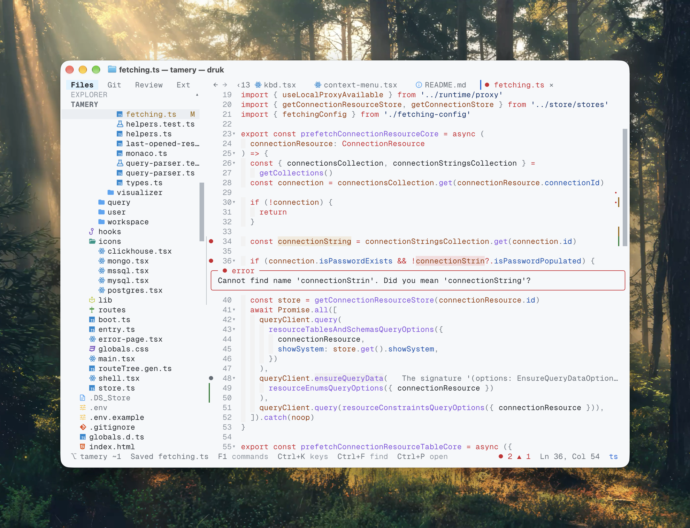

# Druk

A code editor for the terminal. File tree, tabs, search, git marks and syntax highlighting
for 30+ languages — keyboard and mouse.



## Install

druk is one self-contained executable. Nothing else to install — no Node, no Bun.

```bash
curl -fsSL https://druk.letstri.dev/install | bash
```

Or through a package manager:

```bash
npm install -g druk
```

```bash
bun add -g druk
```

macOS (arm64, x64), Linux (arm64, x64) and Windows (x64). Binaries are also on the
[releases page](https://github.com/letstri/druk/releases).

To upgrade later, whichever way you installed:

```bash
druk update
```

It works out how this copy was installed — Homebrew, the install script, or a global
`npm`/`pnpm`/`yarn`/`bun` package — and runs that upgrade, printing the command first.

<details>
<summary>Install options</summary>

The script puts the binary in `~/.druk/bin` and adds it to your `PATH`. Pin a version with
`| bash -s -- --version 1.0.1`, or keep your shell config untouched with `--no-modify-path`.
The npm and bun packages are a launcher that downloads that same binary on install — set
`DRUK_DOWNLOAD_BASE` to a mirror if your network cannot reach GitHub.

</details>

## Open a project

```bash
druk                  # the current directory
druk ./my-app         # a directory
druk src/main.ts      # a single file
druk src/main.ts:42   # …opened at line 42
```

`npx druk` and `bunx druk` work without installing anything.

Given a file, druk opens it with the sidebar hidden — `Ctrl+B` brings the tree back, and
the folder around the file is still the project for search and git.

## The basics

The window is a **file tree** on the left, **tabs** along the top, the **editor**, and a
status bar with the branch, unsaved state and cursor position.

- `Tab` moves from the tree to the editor, `Esc` moves back.
- In the tree: `↑` `↓` to move, `→` `←` to open and close folders, `Enter` to open a file.
- Opening a file from the tree previews it: the tab is *italic* and the next file you
  open takes its place. Double-click it, or start editing, and the tab stays for good.
- `Ctrl+S` saves. Closing a tab with unsaved edits asks first.
- `Ctrl+P` opens the command palette — every feature is in there, and typing filters it,
  so you never have to remember a shortcut. `Ctrl+P` → `Keyboard shortcuts` shows them all.
- `Ctrl+K` peeks: a strip over the status bar listing every key that works right now,
  gone again on the next keypress.

## Shortcuts

| Key | Does |
| --- | --- |
| `Ctrl+P` | Command palette |
| `Ctrl+K` | Peek at every key for the pane you are in |
| `Ctrl+O` | Open any file in the project (fuzzy) |
| `Ctrl+T` | Switch between open tabs |
| `Ctrl+S` | Save |
| `Ctrl+F` | Find in this file (`Tab` adds replace) |
| `Ctrl+R` | Find in the whole project |
| `Ctrl+G` | Go to line |
| `Ctrl+N` | New file |
| `Ctrl+W` | Close tab |
| `Ctrl+B` | Show / hide the sidebar |
| `Ctrl+Q` | Quit |
| `Ctrl+Z` / `Ctrl+Y` | Undo / redo |
| `Ctrl+C` / `Ctrl+X` / `Ctrl+V` | Copy / cut / paste (system clipboard, OSC52 over SSH) |
| `Ctrl+/` or `Ctrl+L` | Toggle comment |
| `Opt+↑` / `↓` | Move line or selection |
| `Opt+Shift+↑` / `↓` | Duplicate line or selection |
| `Ctrl+Opt+T` | Reopen closed tab |
| `Ctrl+Opt+←` / `→` | Previous / next tab |

In the tree: `a` new file, `A` new folder, `r` rename, `d` delete, `x` cut, `c` copy,
`p` paste here, `Shift+↑`/`↓` select several rows, `[` / `]` resize the sidebar.

Three things worth knowing: `Ctrl+C` copies when text is selected and quits when nothing
is, so it never throws away unsaved work. There are no `Ctrl+Shift` shortcuts — most
terminals cannot tell them apart from plain `Ctrl` — so a second modifier is always
`Ctrl+Opt`. And if your fingers are set in VS Code's ways, `"keybindings": "vscode"`
gives `Ctrl+P` to the file picker and moves the palette to `F1` (and `Ctrl+Shift+P`,
in terminals that can send it).

### The Opt / Alt key

druk names the key for your OS: `Opt` (Option, ⌥) on macOS, `Alt` everywhere else.
Every shortcut works in a stock terminal — nothing to configure. The line commands are
also in the palette (`Ctrl+P`). Some terminals (macOS Terminal.app among them) cannot
send `Ctrl+/` at all — that is why *Toggle comment* also answers to `Ctrl+L`.

## Search

`Ctrl+F` searches the open file, `Ctrl+R` the project (`Ctrl+Opt+F` too — that is the one
to use in vim mode, where `Ctrl+R` is redo). Whatever you had selected is already in the box.

Results are grouped by file, each row showing the line number and the line with the hit
picked out, and the lines around the selected match are previewed underneath. `Tab` folds
the file you are on, so one file with forty hits stops burying the rest.

In file search, `Tab` opens the replace field instead: `Enter` replaces the selected match,
`Ctrl+A` replaces every match in the file.

`Ctrl+C`, `Ctrl+W` and `Ctrl+R` toggle case-sensitive, whole-word and regex matching
while the search is open; the active ones are shown beside the match count.

## Files

`x` picks a file or folder up and `p` drops it in the folder you are on — paste onto a
*file* and it lands beside it, so you never have to aim exactly. `c` copies instead, and
keeps the clipboard, so the same thing can go into several folders. Nothing is overwritten:
a taken name gets a `copy` suffix (`app copy.ts`), which is also how you duplicate in place.

Open tabs, unsaved edits and expanded folders all follow whatever you move or rename.

Deleting, moving or copying a lot at once runs in the background: the status bar counts
what is done and the editor stays usable, instead of freezing until a `node_modules` is
gone.

## Git

Read-only, on purpose: druk shows what git says and never changes it. Changed lines are
marked in the gutter and again beside the scrollbar, where the whole file's changes are
visible at once — a mark there is somewhere to scroll to. Files in the tree carry `M` `A`
`U` `D` marks, and the status bar shows the branch and how far it is from upstream —
`⎇ main ↑2 ↓1 ~3` is two commits to push, one to pull, three changed files. Work you do in
another terminal shows up without a restart.

## Settings

Change things from the palette (`Ctrl+P`), or edit `~/.config/druk/config.json` directly.
A bad value falls back to the default instead of breaking startup.

| Setting | Default | |
| --- | --- | --- |
| `theme` | `"dark"` | `dark`, `light`, `ayu-dark`, `ayu-mirage`, `ayu-light`, `catppuccin-mocha`, `catppuccin-macchiato`, `catppuccin-frappe`, `catppuccin-latte`, `dracula`, `everforest-dark`, `everforest-light`, `gruvbox`, `gruvbox-light`, `kanagawa-wave`, `kanagawa-dragon`, `kanagawa-lotus`, `nord`, `one-dark`, `rose-pine`, `rose-pine-moon`, `rose-pine-dawn`, `solarized-dark`, `solarized-light`, `tokyo-night`, `vesper` |
| `tabSize` | `2` | 1–16 |
| `vim` | `false` | normal / insert / visual modes, `hjkl w b 0 $ gg G`, counts, `i a o`, `x dd dw cw`, `v` + `d y c`, `yy p P`, `u` / `Ctrl+R` |
| `keybindings` | `"default"` | `"vscode"` gives `Ctrl+P` to the file picker and moves the palette to `F1` / `Ctrl+Shift+P` |
| `sidebarWidth` | `"auto"` | a quarter of the window, or pin 15–80 columns |
| `trimOnSave` | `false` | on save: strip trailing spaces and end the file with one newline |
| `autoSaveOnBlur` | `false` | save unsaved tabs when switching tabs or when the terminal window loses focus |

druk also remembers each project's open tabs, active file and expanded folders, and
restores them the next time you open that directory.
